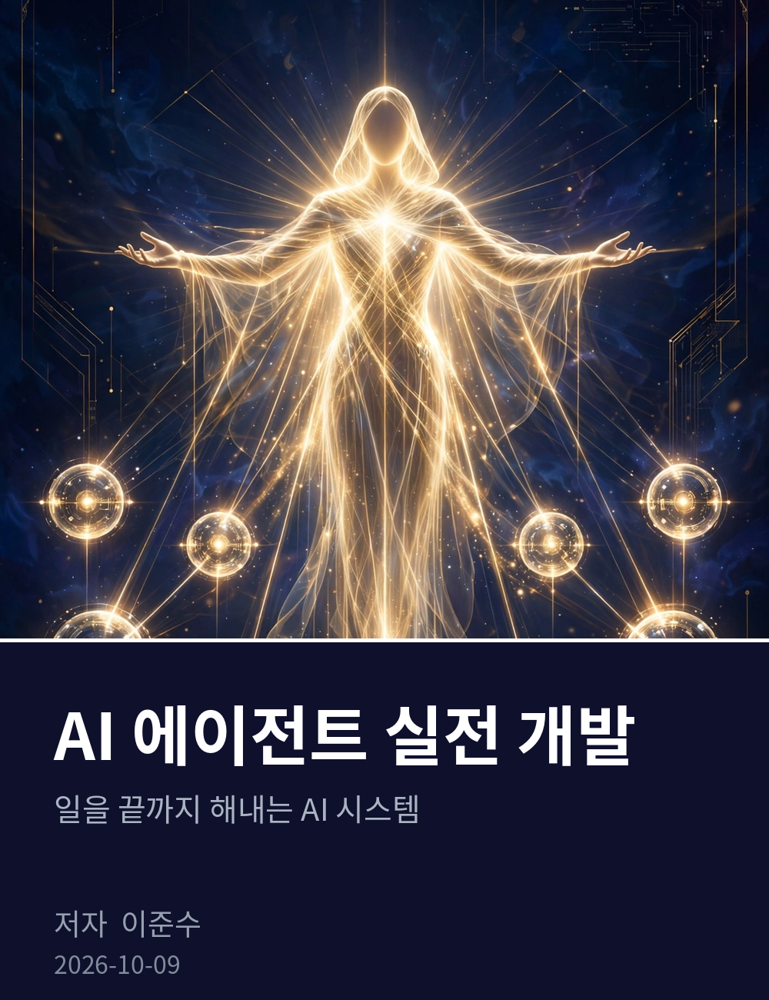

# AI 에이전트 실전 개발

일을 끝까지 해내는 AI 시스템 만들기

저자: 이준수
기준일: 2026-10-09

이 책은 위키독스에서 무료로 읽을 수 있는 공개 도서입니다.
Anthropic의 Building Effective Agents(https://www.anthropic.com/engineering/building-effective-agents)와 공식 문서(https://docs.anthropic.com/)를 함께 참고하세요.

문의: 1130dlwltn2@gmail.com
인공지능 정보공유 단톡방 참여 문의: https://open.kakao.com/o/s4OEqBai
