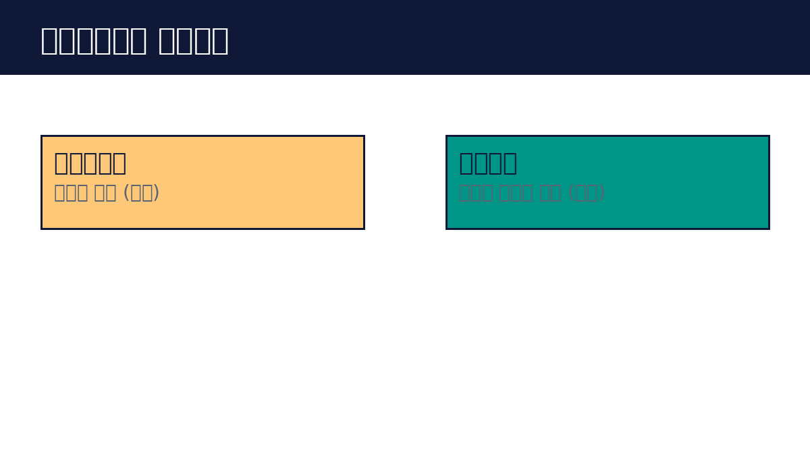

# Part 1. 에이전트란 무엇인가

## 10. 에이전트와 워크플로우의 구분

에이전트와 워크플로우는 다릅니다. 워크플로우는 정해진 경로를 따라가는 시스템입니다. A를 하면 B를 하고, B가 끝나면 C를 합니다. 순서가 코드에 적혀 있습니다. 예측 가능하고 빠르고 저렴합니다.

에이전트는 스스로 경로를 정하는 시스템입니다. 목표만 주고, 어떻게 할지는 모델이 정합니다. 도구를 쓰고, 결과를 보고, 다음 행동을 정합니다. 유연하지만 예측하기 어렵고 비용이 듭니다.

비유를 들어 보겠습니다. 워크플로우는 기차입니다. 선로가 정해져 있고, 정해진 역에 섭니다. 에이전트는 택시입니다. 목적지만 말하면 기사가 길을 찾습니다. 기차가 빠르지만, 선로 없는 곳은 못 갑니다.

실전에서는 둘을 섞어 씁니다. 전체 흐름은 워크플로우로 잡고, 판단이 필요한 구간만 에이전트로 둡니다. "정해진 순서로 처리하되, 예외 상황에서는 AI가 판단하게" 하는 식입니다. 이것이 가장 흔하고 안정적인 설계입니다.

핵심 정리
- 워크플로우는 정해진 경로, 에이전트는 스스로 정하는 경로다.
- 워크플로우는 빠르고 저렴하고 예측 가능하다.
- 실전에서는 워크플로우 안에 에이전트를 넣는 혼합이 많다.
