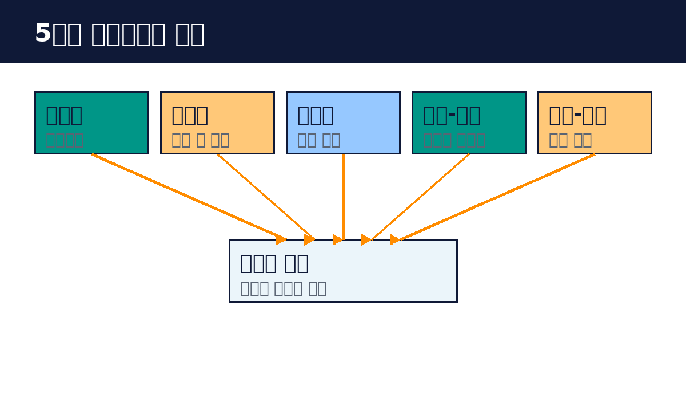

# Part 2. 5가지 워크플로우 패턴

## 20. 프롬프트 체이닝

프롬프트 체이닝은 작업을 단계로 나누어 순서대로 처리하는 패턴입니다. 첫 단계의 출력이 다음 단계의 입력이 됩니다.

예를 들어 보겠습니다. "긴 보고서를 요약해줘"를 한 번에 하면 품질이 떨어집니다. 대신 세 단계로 나눕니다. 1단계에서 핵심 문장을 뽑고, 2단계에서 구조를 잡고, 3단계에서 최종 요약문을 씁니다. 각 단계는 단순해지고, 중간 결과를 확인할 수 있습니다.

이 패턴이 좋은 경우입니다. 작업이 자연스럽게 단계로 나뉠 때입니다. 각 단계의 품질이 다음 단계에 영향을 줄 때입니다. 중간에 검증을 넣고 싶을 때입니다.

설계 요령입니다. 단계를 너무 잘게 나누지 않습니다. 3~5단계가 적당합니다. 각 단계의 입력과 출력을 명확히 정합니다. 중간 결과를 로그로 남겨 디버깅에 씁니다.

실습: 3단계 요약기
1. 핵심 문장 추출 프롬프트 만들기
2. 구조 잡기 프롬프트 만들기
3. 최종 요약 프롬프트 만들기
4. 이어서 실행해 보기

핵심 정리
- 단계를 나누어 순서대로 처리하고, 출력이 다음 입력이 된다.
- 각 단계가 단순해지고 중간 검증이 가능하다.
- 3~5단계가 적당하고 입출력을 명확히 정한다.
