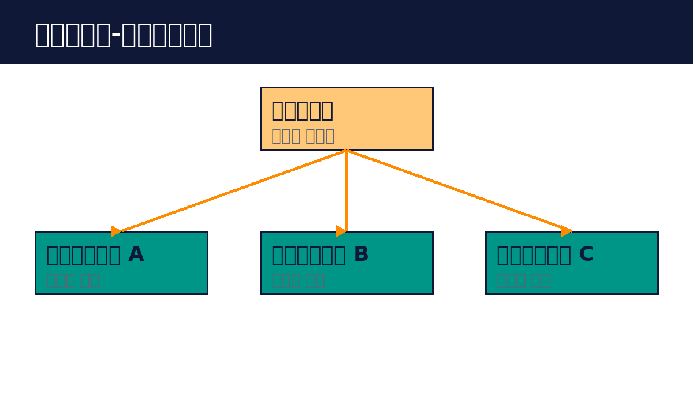

# Part 3. 멀티 에이전트

## 30. 코디네이터-서브에이전트

코디네이터-서브에이전트는 여러 에이전트를 함께 쓰는 기본 구조입니다. 코디네이터가 전체 목표를 보고 일을 나누고, 서브에이전트들이 각자 일을 하고, 코디네이터가 결과를 합칩니다.

오케스트레이터-워커와의 차이입니다. 워커는 정해진 일을 하지만, 서브에이전트는 스스로 판단합니다. 코디네이터가 "이 부분을 조사해줘"라고 하면, 서브에이전트는 어떤 도구를 쓸지 스스로 정합니다. 유연성이 더 큽니다.

예를 들어 보겠습니다. "경쟁사 3곳의 가격 정책을 조사해줘"를 하면, 코디네이터가 회사별로 서브에이전트를 띄웁니다. 각 서브에이전트는 검색하고 읽고 정리합니다. 코디네이터가 세 결과를 비교표로 합칩니다.

이 구조가 좋은 경우입니다. 작업이 크고, 각 부분에서 판단이 필요할 때입니다. 병렬로 하면 빠를 때입니다. 각 부분을 독립적으로 검증하고 싶을 때입니다.

설계 요령입니다. 코디네이터의 지시는 명확히, 서브에이전트의 재량은 넓게 둡니다. 서브에이전트의 결과를 검증합니다. 틀린 결과가 합쳐지면 전체가 틀어집니다. 깊이를 제한합니다. 서브에이전트가 또 서브에이전트를 부르는 식으로 깊어지면 관리가 어렵습니다.

핵심 정리
- 코디네이터가 나누고 서브에이전트가 판단하며 처리한다.
- 워커보다 유연하지만 검증이 더 중요하다.
- 깊이를 제한하고 결과를 검증한다.
