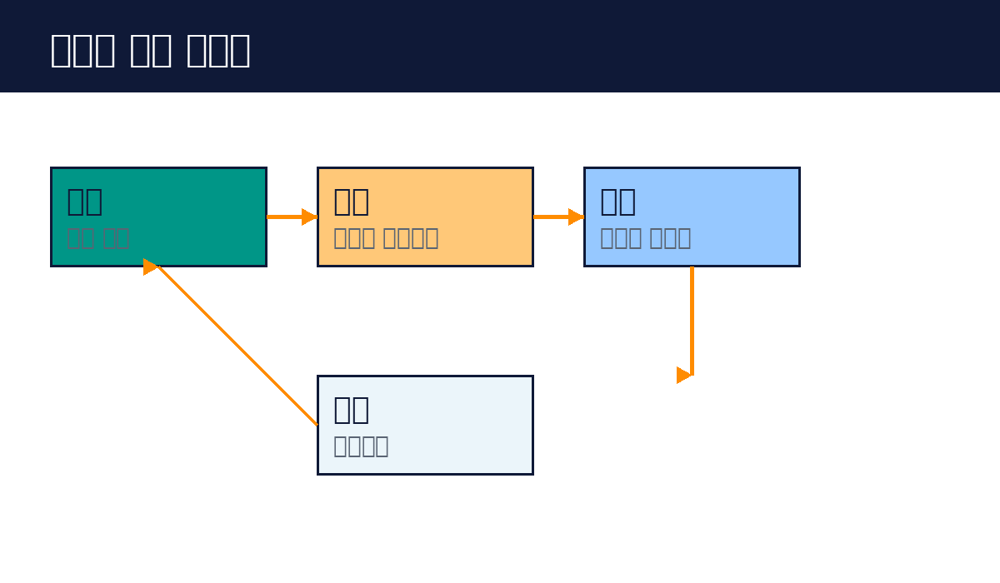

# Part 5. 평가와 안전

## 50. 평가

에이전트를 만들었으면 평가해야 합니다. 느낌이 아니라 숫자로 봅니다.

평가의 기본은 테스트 케이스입니다. 실제 입력 20~50개를 모읍니다. 각 입력에 기대 결과를 적습니다. 에이전트를 돌려 결과를 비교합니다. 통과율을 봅니다. 이것이 가장 확실한 평가입니다.

평가 기준을 정합니다. 정답이 명확한 것은 정확도로 봅니다. 답이 여러 개인 것은 기준을 나눕니다. 예를 들어 고객 응대는 "정확한 정보", "적절한 어투", "빠른 해결"로 나눠 봅니다. 각 기준을 1~5점으로 매깁니다.

LLM을 평가자로 쓰는 방법도 있습니다. 강한 모델에게 기준과 결과를 주고 점수를 매기게 합니다. 사람이 일일이 보기 어려울 때 씁니다. 다만 평가자도 틀릴 수 있으니, 중요한 것은 사람이 봅니다.

평가의 운영입니다. 바꿀 때마다 돌립니다. 프롬프트를 고쳤으면 테스트 케이스를 돌려 통과율이 떨어지지 않았는지 봅니다. 실패 사례는 케이스로 추가합니다. 테스트가 쌓일수록 에이전트가 안정됩니다.

핵심 정리
- 실제 입력 20~50개로 테스트 케이스를 만든다.
- 기준을 나누어 점수로 보고, 바꿀 때마다 돌린다.
- 실패 사례는 케이스로 추가해 쌓는다.
