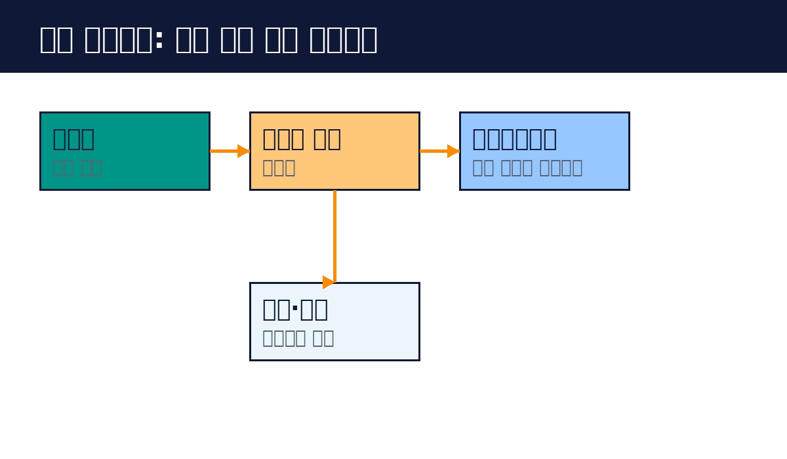

# Part 7. 실전 프로젝트

## 70. 고객 문의 처리 에이전트

지금까지 배운 것을 모아 실전 프로젝트를 합니다. 고객 문의를 분류하고 답변하는 에이전트를 만듭니다.

프로젝트 목표입니다. 고객 문의가 오면 종류를 분류하고, 종류에 맞는 답변을 만들고, 확신이 낮으면 사람에게 넘깁니다. 사람이 하던 1차 응대를 에이전트가 맡습니다.

1단계, 라우팅을 만듭니다. 문의 종류를 정합니다. 환불, 배송, AS, 기타 4개로 합니다. 분류 프롬프트를 만듭니다. 가벼운 모델로 충분합니다. 테스트 케이스 30개를 모아 통과율을 봅니다.

2단계, 종류별 처리를 만듭니다. 환불은 환불 정책 문서를 보고 답합니다. 배송은 배송 조회 도구를 씁니다. AS는 접수 양식을 만듭니다. 각 경로는 프롬프트 체이닝으로 구성합니다.

3단계, 도구를 연결합니다. 배송 조회 API를 도구로 만듭니다. 정책 문서는 MCP 서버나 리소스로 줍니다. 도구 설명을 다듬습니다.

4단계, 휴먼인더루프를 둡니다. 분류 확신이 80% 미만이면 사람에게 넘깁니다. 환불 승인 같은 위험한 행동은 사람이 확인합니다. 사람에게 보여줄 화면을 만듭니다. 판단 근거와 선택지를 보여줍니다.

5단계, 평가와 가드레일을 둡니다. 테스트 케이스로 통과율을 봅니다. 입력 가드레일로 악의적 입력을 막습니다. 출력 가드레일로 개인정보 노출을 막습니다.

6단계, 운영합니다. 성공률과 사람 개입 비율을 봅니다. 실패 사례를 모아 케이스에 추가합니다. 요청당 비용을 봅니다. 안정되면 사람의 개입을 줄입니다.

이 프로젝트를 마치면 에이전트 개발의 전체 사이클을 경험합니다. 설계, 구현, 평가, 운영까지. 다음 에이전트는 더 잘 만들 수 있습니다.

핵심 정리
- 라우팅으로 분류하고 종류별로 처리한다.
- 확신이 낮거나 위험하면 사람에게 넘긴다.
- 평가, 가드레일, 운영까지 갖춘 것이 완성이다.
